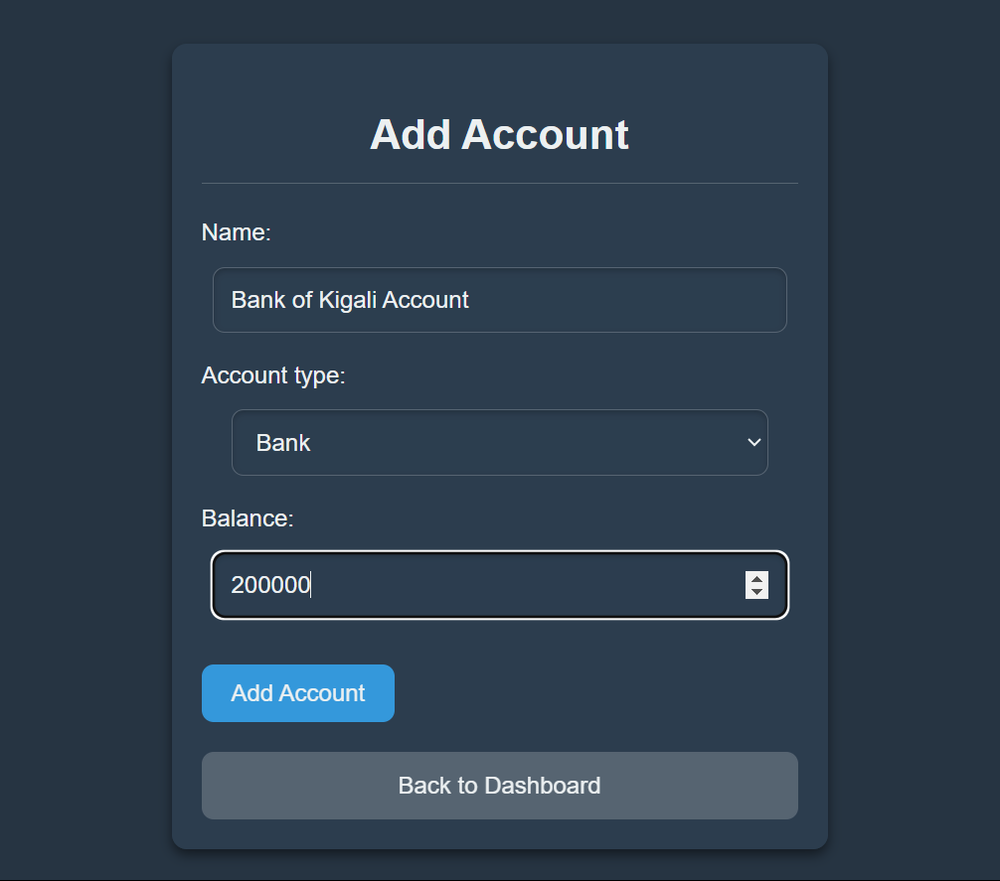
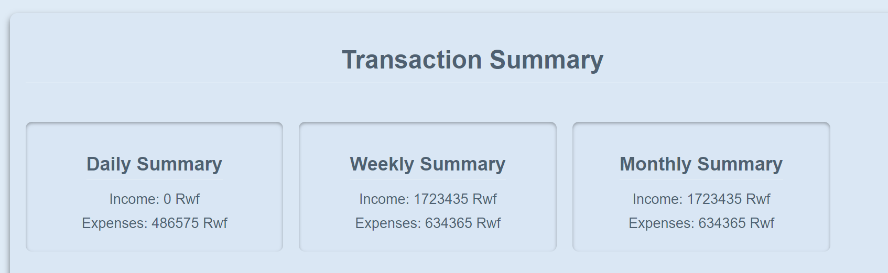
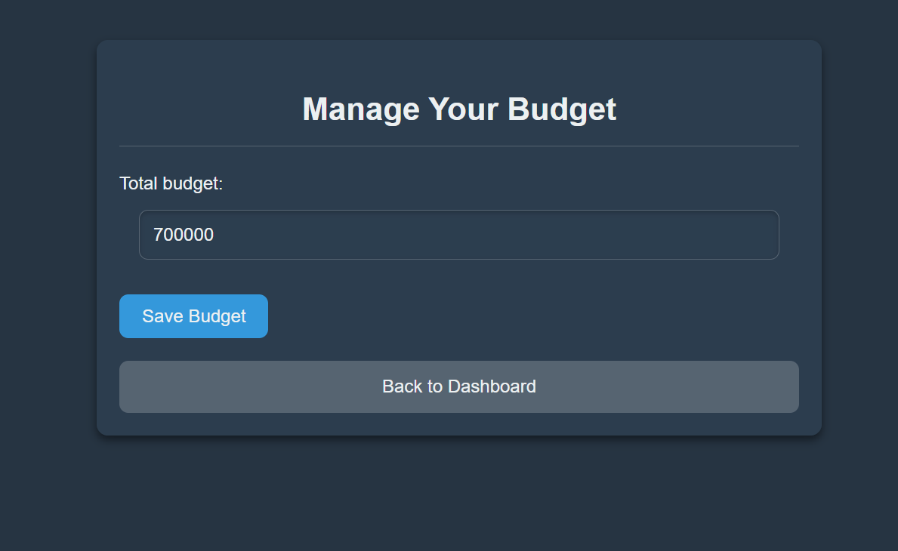
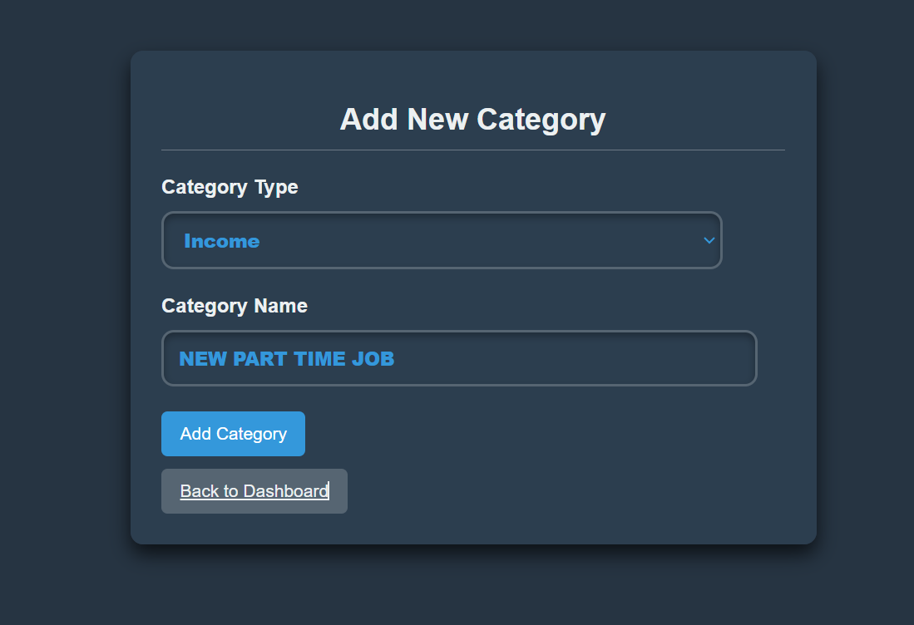
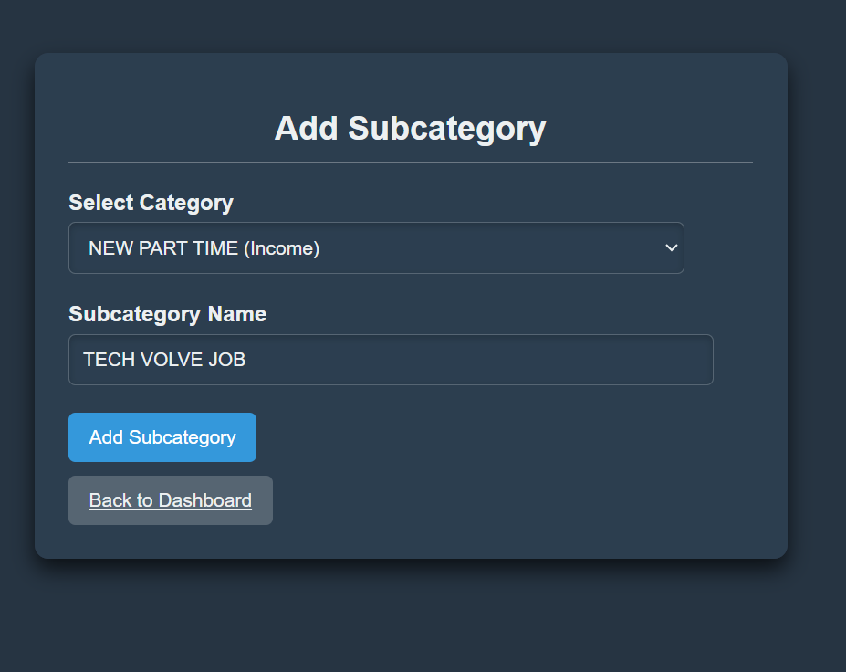

---

# iSpendIT: Personal Finance Tracker

iSpendIT is a personal finance tracking application designed to help users manage their finances effectively. The app features account tracking, budget management, transaction categorization, and visualized data for financial insights.

---

## Table of Contents

1. [Project Overview](#project-overview)  
2. [Features](#features)  
3. [Technologies Used](#technologies-used)  
4. [Setup and Installation](#setup-and-installation)  
5. [Usage](#usage)  
6. [Screenshots and Sections](#screenshots-and-sections)  
   - [Home Page Overview](#home-page-overview)  
   - [Login and Signup](#login-and-signup)  
   - [Other Pages](#other-pages)  
7. [API Documentation](#api-documentation)  
8. [Contributing](#contributing)  
9. [License](#license)  
10. [Contact](#contact)  

---

## Project Overview

iSpendIT simplifies financial management by allowing users to:
- Add and manage accounts.
- Set budgets and track expenses.
- Categorize transactions and view trends.
- Gain insights into spending and saving patterns through visualized data.

This project is live at:  
👉 **[iSpendIT on PythonAnywhere](https://ispendit.pythonanywhere.com/)**

The project comprises:
- A **Django-based web application** for managing finances.
---

## Features

- **Account Overview**: Monitor balances for various accounts.
- **Budget Tracking**: Set a budget, track expenses, and get alerts for overruns.
- **Transaction Management**: Filter transactions by date, category, or type.
- **Categories and Subcategories**: Organize income and expenses into groups.
- **Data Visualization**: Gain insights through graphs and charts.
- **User Authentication**: Secure signup, login, and logout functionality.
- **Responsive Design**: Accessible across devices.

---

## Technologies Used

### Backend:
- **Django** (Python) for server-side logic and API handling.
- **SQLite** as the database (can be switched to PostgreSQL or MySQL).

### Frontend:
- **HTML5**, **CSS3**, **JavaScript** for the user interface.
- **Bootstrap** for responsive design.


### Additional Tools:
- **Django REST Framework** for API creation.
- **Chart.js** for data visualization.

---

## Setup and Installation

Follow these steps to set up the project locally:

1. **Clone the Repository**:
   ```bash
   git clone https://github.com/hirwacedric123/ispending.git
   cd ispending
   ```

2. **Create a Virtual Environment**:
   ```bash
   python -m venv venv
   source venv/bin/activate   # For Linux/macOS
   venv\Scripts\activate      # For Windows
   ```

3. **Install Dependencies**:
   ```bash
   pip install -r requirements.txt
   ```

4. **Run Migrations**:
   ```bash
   python manage.py makemigrations
   python manage.py migrate
   ```

5. **Create a Superuser**:
   ```bash
   python manage.py createsuperuser
   ```

6. **Run the Development Server**:
   ```bash
   python manage.py runserver
   ```

---

## Usage

## - **Web App**: Access the dashboard at `http://127.0.0.1:8000/` or the hosted link: [https://ispendit.pythonanywhere.com/](https://ispendit.pythonanywhere.com/).   

---

## Screenshots and Sections

Here's how you can structure the README to explain each section of the home page with corresponding screenshots:

---

### Home Page Overview

The **home page** of iSpendIT is designed to provide users with an at-a-glance view of their financial data and quick access to key features. Below are the sections of the home page, along with their functionality and screenshots for reference.

---

#### 1. **Header Section**

- **Purpose**: Displays a personalized welcome message to the user along with a logout button for secure session termination.
- **Components**:
  - Welcome message: `Welcome, [User's First Name]!`
  - Logout button: Redirects to the logout page.

**Screenshot**:  
**

---

#### 2. **Account Overview Section**

- **Purpose**: Provides a summary of all accounts added by the user, showing their type and current balance. Users can also add new accounts from this section.
- **Components**:
  - Cards displaying account details:
    - Name of the account.
    - Type of the account (e.g., Savings, Checking).
    - Current balance (formatted in Rwf).
    - Color-coded based on balance:
      - **Green** for positive balances.
      - **Red** for negative balances.
  - **Add New Account Button**: Allows users to add a new account directly.

**Screenshot**:  
**

---

#### 3. **Budget Overview Section**

- **Purpose**: Shows the user's budget status, including total budget, total expenses, and remaining budget. Alerts are displayed if the user exceeds their budget.
- **Components**:
  - **Cards for Budget Metrics**:
    - **Total Budget**: Displays the total amount set by the user.
    - **Total Expenses**: Summarizes all expenses.
    - **Remaining Budget**: Highlights the remaining amount and shows a warning if the user goes over budget.
  - **Manage Budget Button**: Provides access to update or set a budget.

**Screenshot**:  
**

---

#### 4. **Recent Transactions Section**

- **Purpose**: Displays a table of the most recent transactions, with options to filter by date range, category, and type (income or expense). Users can add new transactions or view data visualizations.
- **Components**:
  - **Filters**:
    - Start Date and End Date: Select a specific date range.
    - Category: Filter by income or expense categories.
    - Transaction Type: Filter by income or expense transactions.
  - **Table**: Shows details for each transaction:
    - Date
    - Type (Income or Expense)
    - Amount
    - Description
    - Account linked to the transaction
  - **Buttons**:
    - Add New Transaction
    - View Visualized Data

**Screenshot**:  
**

---

#### 5. **Categories and Subcategories Section**

- **Purpose**: Lists all categories and subcategories for income and expenses. Users can add or manage categories and subcategories from this section.
- **Components**:
  - **Expense Categories**: Displays all expense categories and their respective subcategories.
  - **Income Categories**: Lists all income categories with their respective subcategories.
  - **Actions**:
    - Add Category Button
    - Add Subcategory Button

**Screenshot**:  
**

---


---

### Login and Signup

#### 1. **Signup Page**
- **Purpose**: Allows new users to create an account.
- **Fields**:
  - Username
  - Email Address
  - Password (with confirmation)
- **Action**: Registers the user and redirects to the login page.

**Screenshot**: ** 

#### 2. **Login Page**
- **Purpose**: Enables registered users to log in to their dashboard.
- **Fields**:
  - Username or Email Address
  - Password
- **Action**: Authenticates the user and redirects to the home page upon success.

**Screenshot**: **  

#### 3. **Logout**
- **Purpose**: Securely logs the user out and redirects them to the login page.

---

### Other Pages

#### Add Account, Transaction Summary, and Budget Management  , Add Transaction pages and so on
 ## Other Pages

### 1. Add Account Page
**Purpose:** Allows users to add new financial accounts.

**Fields:**
- **Account Name**
- **Account Type** (e.g., Savings, Checking)
- **Initial Balance**

**Action:** Adds a new account to the database.

**Screenshot:**  


---

### 2. Transaction Summary Page
**Purpose:** Visualizes transaction data through graphs and charts.

**Components:**
- **Pie charts** for category-wise expenses.
- **Line charts** for monthly trends.

**Screenshot:**  


---

### 3. Manage Budget Page
**Purpose:** Enables users to set or update their monthly budget.

**Fields:**
- **Total Budget Amount**

**Screenshot:**  



### 4. Add Category Page
**Purpose:** Allows users to add new income or expense categories.

**Fields:**
- **Category Name**
- **Category Type** (e.g., Income, Expense)

**Action:** Adds a new category to the database.

**Screenshot:**  


---

### 5. Add Subcategory Page
**Purpose:** Allows users to add subcategories under existing categories.

**Fields:**
- **Subcategory Name**
- **Parent Category**

**Action:** Adds a new subcategory linked to an existing category.

**Screenshot:**  



---

## Contributing

We welcome contributions! To contribute:

1. Fork the repository.  
2. Create a new branch:  
   ```bash
   git checkout -b feature/your-feature-name
   ```
3. Commit your changes:  
   ```bash
   git commit -m "Add your message here"
   ```
4. Push to your branch:  
   ```bash
   git push origin feature/your-feature-name
   ```
5. Submit a pull request.  

---

## License

This project is licensed under the MIT License. See the `LICENSE` file for details.  

---

## Contact

For questions, suggestions, or feedback, please contact:

- **Name**: Cedric Hirwa  
- **Email**: [your-email@example.com]  
- **GitHub**: [https://github.com/hirwacedric123](https://github.com/hirwacedric123)  

---
